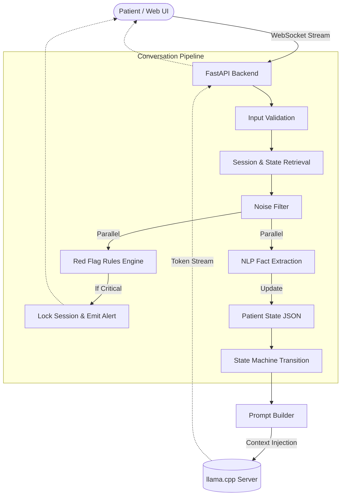
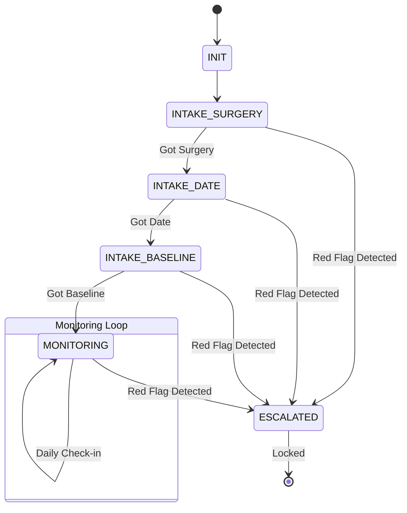
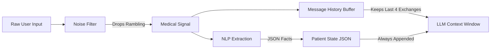
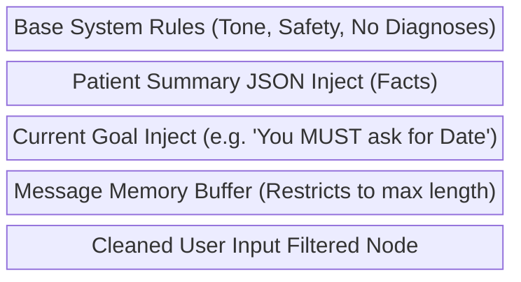
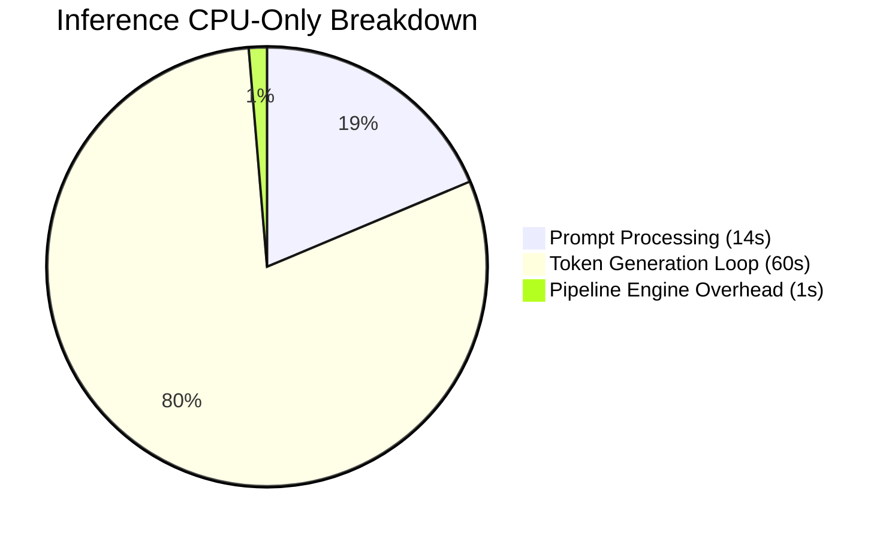
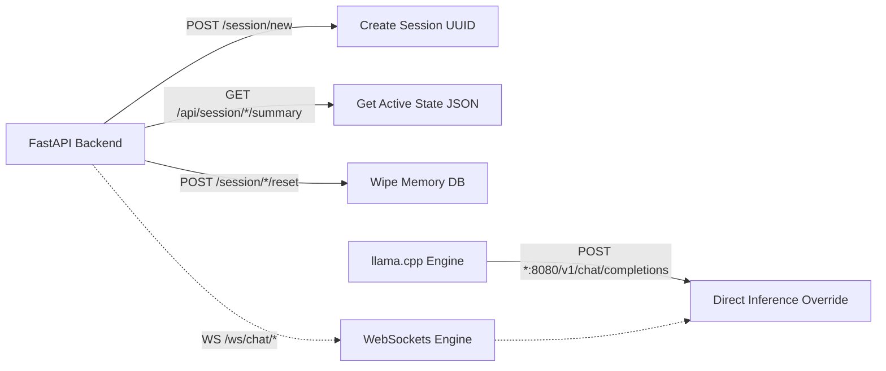

# Medical Post-Op Recovery Companion — Extended (RAG + Tools)

An intelligent, safety-critical conversational agent designed to guide patients through post-operative recovery. Extended with Retrieval-Augmented Generation (RAG), a CRM tool, and three additional callable tools, all integrated with real-time WebSocket streaming.

---

## 📖 Table of Contents
1. [Core Features](#-core-features)
2. [New in Assignment 2: RAG + Tools](#-new-in-assignment-2-rag--tools)
3. [System Architecture](#-system-architecture)
4. [Project Structure](#-project-structure)
5. [Setup Instructions](#-setup-instructions)
6. [RAG System Details](#-rag-system-details)
7. [Tool Catalogue](#-tool-catalogue)
8. [Performance Benchmarks](#-performance-benchmarks)
9. [API & Endpoints](#-api--endpoints)

---

## ✨ New in Assignment 2: RAG + Tools

### 1. Retrieval-Augmented Generation (RAG)
- **60-document medical corpus** covering post-surgery recovery, medications, procedures, complications, physical therapy, and patient care (344 vector chunks).
- **Embedding model:** `all-MiniLM-L6-v2` (22M parameters, runs on CPU, 384-dim embeddings).
- **Vector store:** ChromaDB (persistent local store, cosine similarity).
- **Pipeline:** query embed → top-4 chunk retrieval → context injection into LLM system prompt.
- **Caching:** LRU cache on embeddings for repeated queries; ChromaDB persists across server restarts.
- **Context management:** retrieved context is truncated to 2000 chars max to stay within the model's context window.

### 2. CRM Tool (Mandatory)
Stores patient profiles in `data/crm/users.json` keyed by session ID. The LLM can call:
- `get_user_info(session_id)` — retrieve stored profile for a returning user
- `update_user_info(session_id, field, value)` — store name, phone, allergies, etc.
- `record_interaction(session_id, note)` — log significant events to the patient's history

### 3. Three Additional Tools (FREE External APIs)

| Tool | API | Purpose |
|------|-----|---------|
| **OpenFDA** | FDA Open API | Drug labels, warnings, side effects (FAERS), recalls — "Can dizziness happen after taking aspirin?" |
| **PubMed** | NCBI E-utilities | Peer-reviewed medical research — "What does research say about swelling after knee surgery?" |
| **Google Calendar** | Google Calendar API | Real appointment scheduling — "Schedule a follow-up for next Monday at 10am" |

### 4. Real-Time Streaming with Tools
- **Streaming-first design:** text is yielded token-by-token as it arrives.
- **Tool call detection in-stream:** `generate_stream_with_tools()` buffers `tool_calls` deltas without blocking text delivery.
- **Parallel pre-processing:** RAG retrieval, red-flag detection, and NLP extraction all run concurrently before the LLM call.
- **Async tools:** all tools use `asyncio.to_thread` for I/O and `asyncio.wait_for` with a 20-second timeout (external APIs).

---

## 🏗️ System Architecture

```
[Web UI / React]
      │  WebSocket /ws/chat/{session_id}
      ▼
[FastAPI + WebSocket] (main.py)
      │
      ▼
[Conversation Manager] (manager.py)
      │
      ├─── [Input Validator]
      ├─── [CRM Lookup]          (pre-load user profile)
      ├─── [Noise Filter]
      │
      ├─PARALLEL─────────────────────────────────────────
      │   [NLP Extraction]    [Red Flag Engine]    [RAG Retrieval]
      │   (spaCy/regex)       (vitals/keywords)    (ChromaDB + MiniLM)
      ├─────────────────────────────────────────────────
      │
      ├─── [State Machine]    (INIT→INTAKE→MONITORING)
      ├─── [Prompt Builder]   (patient state + CRM + RAG context)
      │
      ▼
[Tool Orchestrator]
      │
      ├── [CRM Tool]            get/update/record user info
      ├── [OpenFDA Tool]        FDA drug labels, adverse events, recalls (FREE API)
      ├── [PubMed Tool]         medical research paper search (FREE API)
      └── [Google Calendar]     appointment scheduling (FREE API)
      │
      ▼
[LLM Engine — Qwen3-4B via LM Studio]
      │  generate_stream_with_tools()
      │  ─ streams text chunks OR emits tool_calls dict
      │  ─ tool calls executed → results injected → streams follow-up
      │
      ▼
[WebSocket → Frontend: token-by-token streaming]
```

---

---

## 🌟 Core Features

### Major Features
- **Deterministic State Machine:** Forces the LLM to follow strict conversational paths. It will sequentially gather Surgery Type, Date, and Baseline Condition before allowing the user to reach the core monitoring loop.
- **Red Flag Escalation Engine:** A separate parallel thread (running NLP Rule matching) intercepts messages detailing extreme pain (>8) or dangerous fevers (>101°F) in `< 15ms`. It locks the conversation and immediately outputs an emergency response, bypassing LLM generation completely.
- **Dynamic Context Injection:** Extracts rigid patient facts ("Knee Surgery on 10/14") into JSON via local NLP extraction, and appends this JSON to the top of every generated LLM prompt. This actively cures LLM halluciation and context-amnesia.
- **Aggressive Token Pruning:** To respect strict context memory limits (2048/4096 tokens), the conversation history buffer holds only the last 4 exchanges (8 turns total). Rambling inputs are dropped before storing.

### Minor Features
- **WebSocket Streaming Backend:** Generates text outputs token-by-token directly to the patient's browser, preventing 60-second timeouts.
- **Spam & Validation Filters:** Reject inputs over 2000 chars, inputs with no alphanumeric text, or excessive URL injections before they hit the LLM.
- **Local On-Device Privacy:** LLM execution occurs entirely on the local machine using `llama.cpp` — satisfying Medical App HIPAA constraints.

---

## 📁 Project Structure

```text
c:\NLP\Assignment2\Conversational_AI-Backend\
├── agents/                          # Specialized autonomous workflows
│   ├── memory_agent.py              
│   └── response_agent.py            
├── conversation_manager/            # Core state machine logic
│   ├── input_validator.py           # Basic constraints
│   ├── manager.py                   # 11-Step Event Loop orchestrator
│   ├── noise_filter.py              # Truncates rambling user speech
│   ├── patient_state_updater.py     # Invokes NLP extraction routines
│   ├── prompt_builder.py            # Assembles system injection blocks
│   ├── red_flag_engine.py           # Intercepts >101 Temp, >8 Pain
│   ├── session_store.py             # Memory/History UUID tracker
│   ├── state_machine.py             # INIT -> INTAKE -> ESCALATED paths
│   └── summary_builder.py           # Summarizes recent interactions
├── llm_engine/                      # Connects prompt formatting to models
│   ├── qwen_interface.py            # Qwen specific wrappers
│   └── token_manager.py             # Limits model I/O sizes
├── lm_studio/                       # External inference client
│   └── client.py                    # Wrapper for LM Studio execution
├── logs/                            # Output directory for `.log` files
├── models/                          # Data schemas mapped to Pydantic
│   ├── enums.py                     # Rigid types (Stages, flags)
│   └── schemas.py                   # Session variables and payloads
├── nlp_utils/                       # Fact and logic processors
│   ├── extraction.py                # Spacy NLP entity pipeline
│   ├── regex_patterns.py            # Strict string formatters
│   └── symptom_detector.py          # Classifiers for medical queries
├── config.py                        # Constants, defaults, timeouts
└── main.py                          # FastAPI configuration & routers
```

---

## 🏗️ Architecture Overview

The system strictly decouples **conversational empathy** (LLM) from **medical logic and safety** (Deterministic State Machine & Rules Engine). 



*(See `docs/conversation_orchestration_logic.md` for a complete 11-step chronological pipeline chart).*

---

## 🛤️ Conversation Flow & State Design

Instead of allowing the LLM to decide what to ask next, the system tracks the `conversation_stage` and injects strict prompting instructions based on what data is missing from the patient's record.

### The State Machine


*(See `docs/conversation_flow_design.md` for logic transition code).*

---

## 🧠 Context Memory & Noise Filtering

Local LLMs (like Qwen 4B) have strict bounds to generation. If a patient shares lengthy, rambling stories about their day, the context window fills up with "noise," causing the model to forget critical medical instructions or run out of memory (OOM).

**Signal vs Noise Diagram:**


*(See `docs/context_memory_management.md` and `docs/example_dialogues.md` for interaction data).*

---

## 🎯 Prompt Strategies

The system uses a 5-block compound prompt logic. Instead of feeding the whole chat to the LLM indiscriminately:



*(See `docs/prompt_templates.md` for the exact plaintext payload injection logic).*

---

## 💻 Hardware & Performance Benchmarks

To meet healthcare privacy requirements, we deployed **Qwen3-4B-Instruct** (`qwen3-4b-q4_k_m.gguf` / 4-bit) securely inside `llama.cpp`. However, without a dedicated GPU, pure CPU inference causes immense latency.

**CPU Intel i7-8665U Benchmark Profile:**
- **Threads:** 4
- **Prompt Size:** ~150-300 memory tokens.
- **Time to First Token (TTFT):** 10-14 seconds.
- **Generation Speed:** ~0.60 to 1.01 tokens per second.
- **Total Pipeline Wait Time:** 60-90 seconds.



*(See `docs/performance_benchmarks.md` for breakdown constraints).*

---

## ✅ Evaluations & Multi-Turn Diagnostics

To ensure the correctness of our deterministic state machine and Red Flag logic, we performed the following integration tests:

1. **Multi-Turn State Retention Tests**
   - Simulated 10+ turn dialogues to intentionally overrun the memory caps. The conversation history naturally pruned early turns, while the LLM was forced to remember early "Surgery Date" facts because those entities were saved to the deterministic JSON injected into the System Prompt.
2. **Safety Escalation (Red Flag) Latency Tests**
   - Using heuristical keyword rules (Regex + Evaluator), the system intercepts and detains the user for `Fever > 101.4` or `Pain = 9` in **< 15ms**, immediately circumventing the LLM's 60-90 second generation lag.

*(See `docs/multi_turn_dialogue_tests.md` for step-by-step diagnostic dialogues evaluating token expiration limits).*

---

## 🔌 API & Endpoints

This is a developer layout for `FastAPI` (running on `localhost:8000`).



*(For testing with Postman or curl, reference `docs/postman_api_test_cases.md`).*

---

## 🚀 Setup Instructions

### Prerequisites
- Python 3.11+
- Node.js 18+ (for frontend)
- LM Studio with `qwen/qwen3-4b` model loaded and API server running on port 1234

### First-Time Setup (Assignment 2 — RAG + Tools)

```bash
# 1. Navigate to backend
cd backend

# 2. Create and activate virtual environment
python -m venv venv
.\venv\Scripts\activate     # Windows
# source venv/bin/activate  # macOS/Linux

# 3. Install all dependencies
pip install -r requirements.txt
python -m spacy download en_core_web_sm

# 4. Generate the medical corpus and build the RAG vector index
#    (downloads all-MiniLM-L6-v2 on first run — ~90MB)
python scripts/build_index.py

# 5. Start LM Studio and load qwen/qwen3-4b model, enable API server on port 1234

# 6. Start the FastAPI backend
uvicorn main:app --host 0.0.0.0 --port 8000

# 7. In a second terminal — start the frontend
cd remix-of-nurse-ai-companion
npm install
npm run dev
# Visit http://localhost:5173
```

### Rebuilding the Index (after adding/updating documents)
```bash
python scripts/build_index.py --force
```

### Environment Variables (`.env`)
```
LM_STUDIO_BASE_URL=http://127.0.0.1:1234/v1
LM_STUDIO_MODEL=qwen/qwen3-4b
CLINIC_PHONE=123-456-7890
EMBEDDING_MODEL=all-MiniLM-L6-v2   # optional override
```

---

## 📚 RAG System Details

| Property | Value |
|----------|-------|
| Corpus size | 60 documents, 344 chunks |
| Topics | Post-surgery care, medications, orthopedic procedures, complications, physical therapy, nutrition, mental health |
| Embedding model | `all-MiniLM-L6-v2` (sentence-transformers) |
| Embedding dimension | 384 |
| Vector database | ChromaDB (persistent, cosine similarity) |
| Chunk size | ~512 characters with 100-char overlap |
| Top-k retrieved | 4 chunks per query |
| Max context injected | 2000 characters |
| Query caching | LRU cache (256 entries) |
| Retrieval latency | < 200ms on CPU |

### How RAG Works in This System
1. User message is embedded with `all-MiniLM-L6-v2`.
2. ChromaDB returns the top-4 most similar chunks (cosine similarity, normalized).
3. Chunks are formatted into a `[RETRIEVED MEDICAL KNOWLEDGE]` block.
4. This block is appended to the LLM system prompt — the model is instructed to ground its response in this knowledge.
5. RAG retrieval runs **in parallel** with red-flag detection and NLP extraction, adding minimal latency.

---

## 🛠️ Tool Catalogue

### CRM Tools (Mandatory)
| Tool | Arguments | Description |
|------|-----------|-------------|
| `get_user_info` | `session_id` | Retrieve stored patient profile |
| `update_user_info` | `session_id, field, value` | Store/update any profile field |
| `record_interaction` | `session_id, note` | Log an interaction note to patient history |

### OpenFDA Tools (FREE API — No Key Required)
Real-time drug information from the FDA database.

| Tool | Arguments | Description |
|------|-----------|-------------|
| `search_drug_label` | `drug_name, [sections]` | FDA drug labels: warnings, dosage, indications, contraindications, adverse reactions |
| `search_drug_adverse_events` | `drug_name, [top_n]` | Real-world side effects from FAERS database (e.g., "Can dizziness happen after taking aspirin?") |
| `check_drug_recall` | `drug_name` | Check for FDA recalls and enforcement actions |

**Example:**
```
User: "What are the side effects of ibuprofen?"
→ Tool call: search_drug_adverse_events(drug_name="ibuprofen")
→ Returns: Nausea (27,992 reports), Fatigue (32,884 reports), etc.
```

### PubMed Tools (FREE API — NCBI E-utilities)
Search 35+ million biomedical research citations for evidence-based responses.

| Tool | Arguments | Description |
|------|-----------|-------------|
| `search_pubmed` | `query, [max_results], [years_back]` | Search for peer-reviewed research articles (returns title, abstract, PubMed link) |
| `get_pubmed_abstract` | `pmid` | Get full abstract for a specific article |

**Example:**
```
User: "How long does swelling last after knee replacement?"
→ Tool call: search_pubmed(query="post-operative swelling total knee arthroplasty duration")
→ Returns: 3 research articles with abstracts and PubMed URLs
```

**Optional:** Set `NCBI_API_KEY` in `.env` for higher rate limits (3 → 10 req/s).

### Google Calendar Tools (FREE API — OAuth Required)
Real appointment scheduling with Google Calendar.

| Tool | Arguments | Description |
|------|-----------|-------------|
| `create_calendar_event` | `summary, date, [time], [duration_minutes], [description]` | Create a real calendar event |
| `list_calendar_events` | `[max_results], [days_ahead]` | List upcoming appointments |
| `delete_calendar_event` | `event_id` | Cancel an appointment |

**Setup (one-time):**
1. Create OAuth credentials at [console.cloud.google.com](https://console.cloud.google.com/)
2. Enable "Google Calendar API"
3. Download `credentials.json` → `backend/data/calendar/credentials.json`
4. Set `GOOGLE_CALENDAR_ID=primary` in `.env`
5. First tool call opens a browser for authorization (token cached thereafter)

---

## ⚡ Performance Benchmarks

| Component | Latency (CPU) |
|-----------|-------------|
| Input validation | < 5ms |
| RAG retrieval (cached embedding) | 15–25ms |
| RAG retrieval (cold start, model load) | 30–40s (first query only) |
| OpenFDA API call | 2–4s |
| PubMed API call | 3–5s |
| Google Calendar API call | 1–3s |
| CRM tool (local JSON I/O) | < 50ms |
| LLM first token (Qwen3-4B, LM Studio) | 0.5–3s |
| Full response streaming | 10–60s (CPU dependent) |
| Parallel step (RAG + red-flag + NLP) | dominated by longest (NLP ~100ms) |

**Concurrent users:** The async FastAPI + asyncio architecture supports multiple concurrent WebSocket connections. RAG retrieval and tool execution are all async/non-blocking.

---

## 📡 API & Endpoints

| Method | Path | Description |
|--------|------|-------------|
| `GET` | `/health` | Health check |
| `POST` | `/session/new` | Create new session, returns `{session_id}` |
| `POST` | `/session/{id}/reset` | Reset a session |
| `GET` | `/api/session/{id}/summary` | Get patient recovery summary |
| `POST` | `/api/transcribe` | Whisper audio transcription |
| `POST` | `/api/tts` | Piper text-to-speech |
| `WS` | `/ws/chat/{session_id}` | Main chat WebSocket (streaming) |
| `WS` | `/ws/asr` | Real-time ASR via Sherpa-ONNX |

### WebSocket Message Format
**Client → Server:**
```json
{"message": "I had knee surgery 3 days ago and my pain is 6/10"}
```
**Server → Client (streaming):**
Text chunks arrive one by one, terminated by:
```
[END]
```

---

## ⚠️ Known Limitations
- **LLM speed:** CPU-bound without a GPU; a CUDA-enabled GPU or Apple Silicon significantly improves throughput.
- **Tool calling:** Requires the LM Studio model to support OpenAI function-calling format (Qwen3-4B supports this natively).
- **OpenFDA API:** No API key required, but rate-limited; results depend on drug name spelling matching the FDA database.
- **PubMed API:** Free tier allows 3 req/s (10 req/s with optional NCBI API key); abstract retrieval requires internet.
- **Google Calendar:** Requires one-time OAuth setup (credentials.json from Google Cloud Console); gracefully fails if not configured.
- **RAG first query:** Cold start takes 30-40s to load the embedding model; subsequent queries are fast (15-25ms).

---

## 🧪 Running Tests

```bash
cd backend

# Run all tests (RAG, OpenFDA, PubMed, CRM, Calendar)
python scripts/test_rag_tools.py

# Run individual test suites
python scripts/test_rag_tools.py --rag
python scripts/test_rag_tools.py --openfda
python scripts/test_rag_tools.py --pubmed
python scripts/test_rag_tools.py --crm
python scripts/test_rag_tools.py --calendar

# Run multi-turn conversation simulation (requires LLM server running)
python scripts/test_rag_tools.py --chat
```
