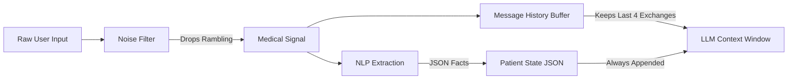

# Context Memory Management Scheme

## The Problem
Local LLMs (like Qwen 4B running on CPU/Consumer GPU) have strict context limits (e.g., 2048 or 4096 tokens). If a patient shares lengthy, rambling stories about their day, the context window fills up with "noise," causing the model to forget critical medical instructions, slow down inference speed, or run out of memory (OOM).

## Token Flow Diagram

## Filtering Signal from Noise
The system implements a multi-tiered Context Memory Management strategy to preserve tokens.

### 1. Hard History Caps (`session_store.py`)
The system never retains the full transcript of the chat. The array is strictly capped at `MAX_HISTORY_TURNS = 8` (4 user messages, 4 assistant messages). Older messages are silently dropped from the prompt array, preventing unbounded token growth.

### 2. State Abstraction (`patient_state`)
Instead of relying on the LLM to remember what the user said 10 messages ago, the system runs parallel NLP extraction to pull out hard facts (Surgery date, current pain scale, fever). These facts are stored in a rigid JSON object (`patient_state`). 
This state JSON is injected at the top of every prompt. Therefore, the LLM is constantly reminded of the patient's facts without needing to read the historical messages where the facts were originally stated.

### 3. Aggressive Noise Filtering (`noise_filter.py`)
If a user submits a monolithic block of text, the system intercepts it before passing it to the LLM. 
It uses a secondary heuristic (or smaller extraction pass) to extract only the medical-relevant sentences, truncating tangents.  
- *Input:* "I woke up today and the weather was so nice, I took the dog out. Oh by the way my knee pain is a 7."
- *Filtered to LLM:* "[Filtered] my knee pain is a 7."

### 4. Dynamic Token Budgets (`config.py`)
The generation engine enforces strict budgets based on the conversation stage:
- **`INTAKE_SURGERY`**: `STAGE_MAX_TOKENS = 80` (requires very short answers)
- **`SUMMARY`**: `STAGE_MAX_TOKENS = 200` (allows longer synthesis)

By severely limiting the output length of the assistant, we prevent the assistant from contributing unnecessary "noise" to the conversational history array.
