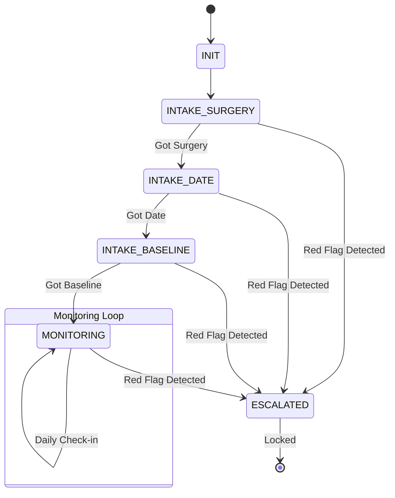

# Conversation Flow Design

The Medical Companion utilizes a **Deterministic State Machine** wrapped around the LLM. Instead of allowing the LLM to decide what to ask next, the system tracks the `conversation_stage` and injects strict prompting instructions based on what data is missing from the patient's record.

## State Machine Stages
1. **`INIT`**: The starting point. The bot greets the user and immediately tries to transition to `INTAKE_SURGERY`.
2. **`INTAKE_SURGERY`**: The system is waiting for the user to specify their surgery type.
3. **`INTAKE_DATE`**: The system is waiting for the dates of the surgery.
4. **`INTAKE_BASELINE`**: The system is waiting to establish a post-op baseline condition.
5. **`MONITORING`**: The core loop where the user is asked about daily symptoms (temperature, pain scale 1-10, physical issues).
6. **`ESCALATED`**: A terminal state triggered by the Red Flag Engine. The conversation is locked, and emergency protocols are displayed.

## Transition Logic (`state_machine.py`)
Transitions only occur if the **Information Extraction** module successfully populates the required fields in the `patient_state` JSON object.

- If `stage == INTAKE_SURGERY` and `patient_state.surgery_type` is valid, transition to `INTAKE_DATE`.
- If `stage == INTAKE_DATE` and `patient_state.surgery_date` is valid, transition to `INTAKE_BASELINE`.
- If `patient_state.red_flag` is flipped to `True` at ANY point, instantly yield to `ESCALATED`.

## LLM Guidance Injection
For each state, a specific directive is appended to the prompt sent to the LLM (e.g., `get_state_prompt_guidance()`).
- *Example for INTAKE_DATE:* "The patient has not yet provided their surgery date. You MUST ask them for the exact date of their surgery."

This hybrid approach guarantees that the medical bot strictly follows necessary intake protocols without getting sidetracked by hallucination or open-ended user inputs.
