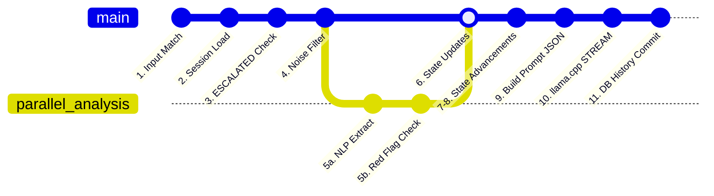

# Conversation Orchestration Logic

The **Medical Recovery Companion** coordinates the conversational experience using a unified asynchronous event loop managed by `conversation_manager/manager.py`.

## Pipeline Overview
The orchestration is organized into an 11-step linear progression for every user message:

1. **Input Validation:** Ensure message isn't empty, doesn't exceed 2000 chars, and bypasses rudimentary spam filters. (`input_validator.py`)
2. **Session Retrieval:** Load the user's specific state and history by UUID. (`session_store.py`)
3. **Escalation Stop:** If the user's state is already locked in `ESCALATED`, instantly yield the emergency message and halt processing.
4. **Noise Filtering:** Aggressively truncate the user's message to isolate only symptoms, reducing noise before LLM injection. (`noise_filter.py`)
5. **Parallel Analysis Data Fetch:**
   - **NLP Extraction:** Spawns an async routine to extract facts (surgery type, pain level) with confidence scores. (`patient_state_updater.py`)
   - **Red Flag Engine:** Spawns a separate async routine to look for "pain > 8" or "fever > 100.4". (`red_flag_engine.py`)
6. **Determine Red Flag Action:** If the Red Flag engine fires, transition to `ESCALATED`, log the event, emit the emergency prompt, and halt the loop.
7. **Evaluate State Transitions:** Evaluate if the newly extracted facts fulfill the requirements for advancing the State Machine (e.g., from `INTAKE_SURGERY` to `INTAKE_DATE`).
8. **Check Remaining Intake Requirements:** Determine if a forced intake directive must be sent to the LLM.
9. **Dynamic Prompt Building:** Assemble the system prompt, the state variables, the conversational history limit, and the user's filtered message into a single robust JSON payload for the LLM.
10. **Generation Engine:** Pass the payload to `llama.cpp` using the FastAPI wrapper (`llama_interface.py`). Stream the response token-by-token back to the client via WebSockets.
11. **Update Ephemeral State:** Commit the new assistant message to the historical context buffer, drop old turns, and calculate `tokens_per_second` metrics for logging.

## Benefits of the Pipeline
- **Real-Time Safety Override:** The Red Flag Engine is completely detached from the LLM. If a user types "I am bleeding out," the Regex/Rules Engine catches it in ~5ms. It does not have to wait 20 seconds for the LLM to generate an empathetic response.
- **Strict Guardrails:** Because the prompt string is dynamically built at runtime, the LLM cannot veer off-course. If the state machine is at `INTAKE_DATE`, the LLM is forcibly instructed to ask about the date, regardless of the prompt history.
