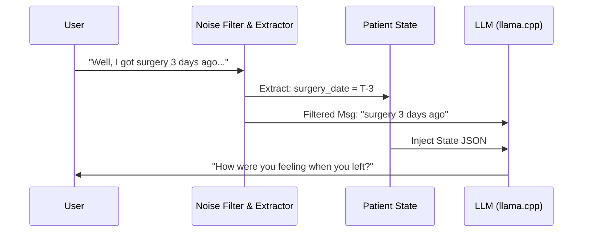

# Example Dialogues

## Scenario 1: Smooth Intake and Routine Check-in
*This dialogue demonstrates a successful completion of the state machine protocol from intake to monitoring.*

**AI:** Hello! I am your Medical Recovery Companion. To get started, could you please tell me what kind of surgery you recently had?
**User:** I had a knee replacement.
**AI:** Thank you indicating a knee replacement. Can you tell me what date your surgery took place?
**User:** It was last Tuesday, the 14th.
**AI:** Got it. How were you feeling generally when you were discharged from the hospital? 
**User:** I was tired and my knee hurt a bit, but mostly okay.
**AI:** Thank you for that baseline. How are you feeling today? Are you experiencing any pain, and have you checked your temperature lately?
**User:** My pain is about a 4 out of 10. No fever, I feel fine.
**AI:** I'm glad to hear you don't have a fever and your pain is manageable. Remember to keep resting and icing the knee.

---

## Scenario 2: Emergency Red Flag Detection
*This dialogue demonstrates the deterministic safety engine overriding the LLM during a critical symptom report.*

**AI:** How are you feeling today? Are you experiencing any pain, and have you checked your temperature lately?
**User:** Actually I feel terrible. My chest hurts really bad, like an 9 out of 10 pain, and I'm having trouble catching my breath.
**AI:** 🚨 **I am concerned about your symptoms.**
Based on your report, you need immediate medical attention.
Please contact your clinic immediately or seek urgent medical care:
- Call: XXX-XXX-XXXX
- Go to: Nearest Emergency Room
- Call 911 if: Severe chest pain, difficulty breathing, loss of consciousness

Your safety is my priority. Medical professionals need to evaluate you now.

*[This conversation will now be locked for your safety]*

---

## Diagnostic Flow Diagram

## Scenario 3: Noise Filtering in Action
*This dialogue shows how the system handles a user who provides too much irrelevant text, filtering it down before processing.*

**AI:** Can you tell me what date your surgery took place?
**User:** Well, I originally wanted to get it done in November but my daughter was visiting from college and the dog got sick so we had to push it back. Finally got it done just three days ago. Glad it's over with honestly.
*(Internal System extracts "three days ago" and filters the rest)*
**AI:** Thank you, I've noted that it was three days ago. How were you feeling when you left the hospital?
