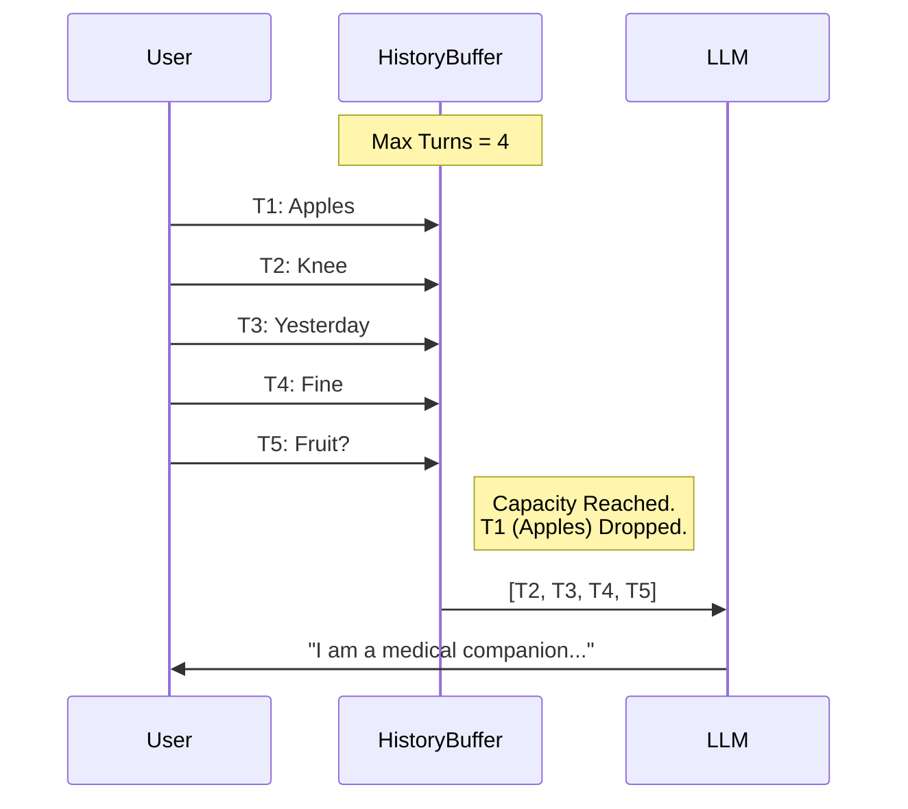

# Multi-Turn Dialogue Tests

This markdown reflects the integration test strategies to ensure the Medical Companion maintains conversational context over multiple exchanges.

## Test Case 1: State Machine Enforcement (Sequential Intake)
The system should refuse to enter the Monitoring phase until the Surgery and Date are recorded.

- **Human:** "Hi, I need help."
- **AI:** "Could you please tell me what kind of surgery you had?" [Expected State: `INTAKE_SURGERY`]
- **Human:** "My pain is a 3."
- **AI:** "I am sorry to hear you are having pain. However, I still need to know what kind of surgery you recently had." [Expected State: `INTAKE_SURGERY`]
- **Human:** "Oh, it was an Appendectomy."
- **AI:** "Thank you. And what date did that take place?" [Expected State: `INTAKE_DATE`]

## Test Case 2: Context Expiration & Hard Capping
The system should naturally 'forget' minor tangents to preserve token budgets after `MAX_HISTORY_TURNS` exchanges.

- **Human:** (Turn 1) "I like apples."
- **AI:** (Turn 1) "I recorded that. What was your surgery?"
- **Human:** (Turn 2) "Knee."
- **AI:** (Turn 2) "When was it?"
- **Human:** (Turn 3) "Yesterday."
- **AI:** (Turn 3) "Baseline condition?"
- **Human:** (Turn 4) "Fine."
- **AI:** (Turn 4) "Any pain?"
- **Human:** (Turn 5) "What is my favorite fruit?"
- **AI:** (Turn 5) "I am sorry, I am a medical companion..." [Context limit exceeded; Apples are flushed from history memory buffer.]

## Test Case 3: Retaining Injected State
Despite the history dropping "Turn 2" (The Knee Surgery), the state-tracker remembers the JSON values over 10+ turns.

- **Human:** (Turn 10) "Can you review what I'm recovering from so I know you're tracking?"
- **AI:** (Turn 10) "You are recovering from a Knee surgery that took place yesterday." [Because the NLP engine stored 'Knee' in `patient_state`, which is appended to the top of EVERY prompt.]

## Extensibility for Pytest Core
To test these multi-turn interactions formally, the system exposes a `/session/SESSION_ID/reset` endpoint, which allows CI/CD to spin up an ephemeral test session, run `N` dialogue combinations over WebSocket, assert the JSON output from `/summary`, and wipe the session clean.
