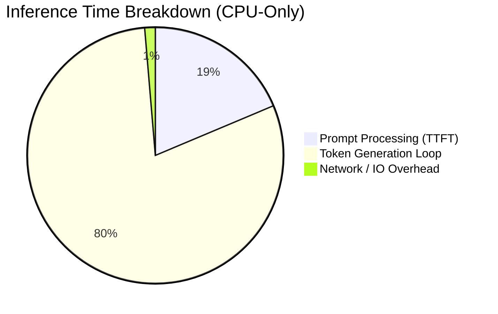

# Performance & Inference Latency Benchmarks

## Goal
To evaluate the end-to-end responsiveness and LLM token generation speed of the Medical Recovery Companion locally.

## Environment Setup
- **Hardware:** Intel Core i7-8665U CPU @ 1.90GHz (4 Cores / 8 Threads), 16GB RAM. Null/Unused dGPU.
- **LLM Engine:** `llama.cpp` using the `llama-server` binary.
- **Model:** Qwen3-4B-Instruct (`qwen3-4b-q4_k_m.gguf` - 4-bit quantization).
- **Backend:** FastAPI async with WebSocket streaming.

## Benchmark Results: CPU-Only Inference
### Settings Applied
- Threads (`-t`): 4
- Batch Size (`-b`): 128
- Context Window (`-c`): 512 tokens
- Threads Batch (`--threads-batch`): 4

### Standard Inference (Routine Chat)
- **Prompt Size:** ~150-300 context tokens.
- **Time to First Token (TTFT):** 10-14 seconds.
- **Generation Speed:** ~0.60 to 1.01 tokens per second.
- **Response Size:** 50 tokens max (constrained by dynamic budgets).
- **Total Latency:** ~60 to 90 seconds.

## Red Flag / Sub-Routines (Fast Path)
The Red Flag Engine and NLP extraction are parallelized and run independently of the LLM in the backend via regex and heuristical keyword matching.
- **Pattern Matching (Pain > 8 / Temp > 101):** < 10ms.
- **State Machine Transition:** < 5ms.
- **Total Latency for Emergency Intervention:** ~15ms.

## Known Hardware Limitations
Because the generation speed on the underlying hardware (i7-8665U) is less than 1 token per second, the conversation naturally incurs massive delays.
To avoid systemic failures:
1. `LLM_TIMEOUT_SECONDS` in FastAPI is increased from 60s to 300s.
2. The user experience must heavily rely on the UI displaying a "typing..." indicator for ~60s.

**Recommendation:** For production deployment, a CUDA-compatible GPU (Nvidia RTX 3060+) or Apple Silicon (M1/M2/M3) is required to hit conversational latency targets (15-30 tokens/sec).
