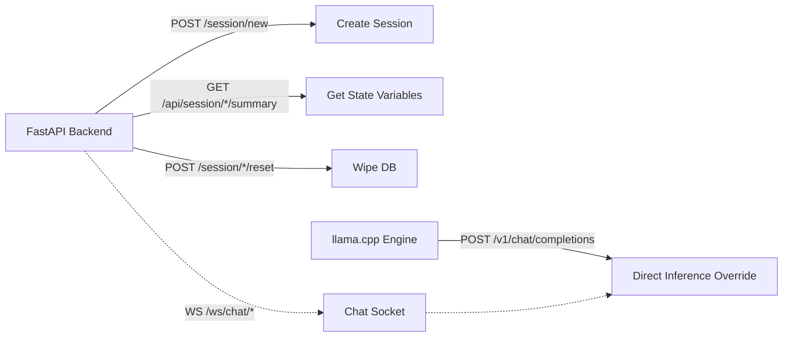

# Postman API Test Cases

This documentation provides the endpoints available in the system for testing using Postman.



## 1. Create a Session
- **Method:** `POST`
- **URL:** `http://localhost:8000/session/new`
- **Description:** Generates a new UUID session token.
- **Expected Success:** `200 OK`
```json
{
    "session_id": "42a47275-e03b-4651-92ed-0473531b2c45"
}
```

## 2. Retrieve State Summary
- **Method:** `GET`
- **URL:** `http://localhost:8000/api/session/{{SESSION_ID}}/summary`
- **Description:** Returns the deterministically extracted JSON parameters detailing the patient's recovery trajectory up to this point in time. 
- **Expected Success:** `200 OK`
```json
{
  "session_id": "42a47275...",
  "stage": "INTAKE_DATE",
  "patient_state": {
    "surgery_type": "Knee Replacement",
    "surgery_date": null,
    "red_flag_detected": false,
    ...
  }
}
```

## 3. WebSockets Chat Engine (Postman WebSockets)
- **Method:** `WS`
- **URL:** `ws://localhost:8000/ws/chat/{{SESSION_ID}}`
- **Description:** Send raw text string messages over the WebSocket connection. The backend will yield token-by-token streaming string responses.

*Example Send:* `I am feeling a 6/10 pain with my Knee.`
*Example Stream Receive:* `I'm` -> ` sorry` -> ` you` -> ` are` -> ` experiencing` -> ` pain...`

## 4. Reset Session Command
- **Method:** `POST`
- **URL:** `http://localhost:8000/session/{{SESSION_ID}}/reset`
- **Description:** Purges the history and states from memory for QA testing reuse.
- **Expected Success:** `200 OK`
```json
{"status": "reset", "session_id": "..."}
```

## 5. Direct LLM Inference Health Check (Llama.cpp)
- **Method:** `POST`
- **URL:** `http://localhost:8080/v1/chat/completions`
- **Body (JSON):**
```json
{
  "model": "qwen3-4b-q4_k_m.gguf",
  "messages": [{"role": "user", "content": "Just say Hello World."}]
}
```
- **Description:** Bypasses the FastAPI orchestration array to test pure generation speeds and functionality of the underlying locally hosted LLM.
