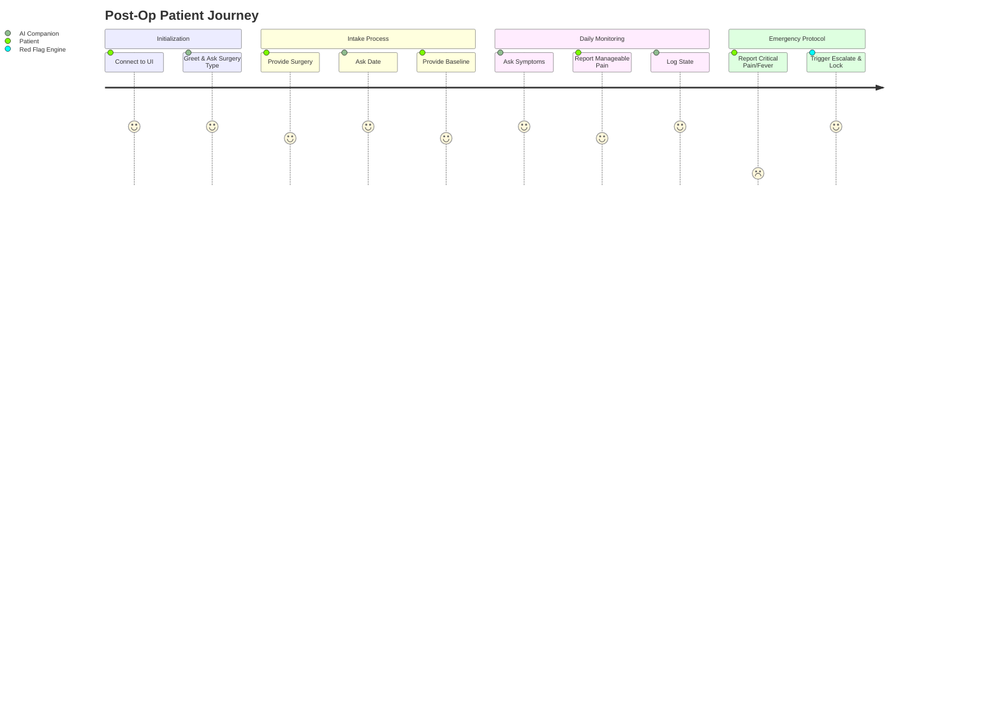

# Use-Case Description: Medical Post-Op Recovery Companion

## Overview
The **Medical Post-Op Recovery Companion** is an intelligent conversational agent designed to assist patients during their post-operative recovery phase. The system automates routine check-ins, gathers critical health data, and escalates to human medical professionals if severe symptoms or "red flags" are detected.

## Target Audience
- **Primary Users:** Patients recovering from recent surgeries at home.
- **Secondary Users:** Clinic staff and doctors who review the summarized recovery data.

## Core Objectives
1. **Automated Intake:** Systematically collect the patient's surgery type, surgery date, and baseline condition.
2. **Symptom Monitoring:** Assess current pain levels, fever progression, and other post-op symptoms daily.
3. **Safety Escalation:** Detect critical red flags (e.g., pain level > 8, fever > 101.0°F) and immediately lock the conversation, instructing the patient to contact emergency services or the clinic.
4. **Data Summarization:** Provide a clear, actionable summary of the patient's state for medical professionals.

## Key Features
- **State-Driven Conversation Engine:** A deterministic state machine guides the LLM to ask required questions before allowing free-form monitoring.
- **Noise Filtering:** Aggressively filters out conversational "fluff" from user input to maintain strict context limits for the LLM. 
- **Parallel Processing:** Uses concurrent processes to evaluate user input for NLP extraction and safety red flags simultaneously. 
- **Local LLM Privacy:** Uses `llama.cpp` locally (with models like Qwen) to ensure patient data never leaves the local network. 

## Typical User Flow

1. Patient opens the web app interface and starts a new session.
2. The AI Companion introduces itself and asks for the type of surgery.
3. The AI asks for the date of surgery.
4. The AI establishes how the patient was feeling when they left the hospital (baseline).
5. The AI transitions to daily monitoring, asking about current pain and temperature.
6. If the patient reports a high fever (e.g., 102°F), the system immediately halts normal conversation, triggers the `ESCALATED` state, and provides emergency contact info. 
